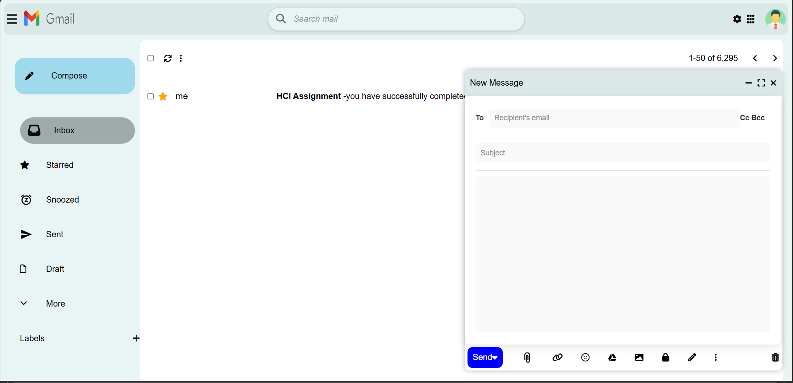
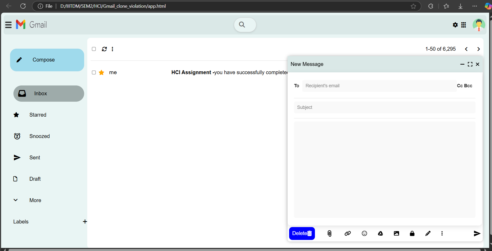
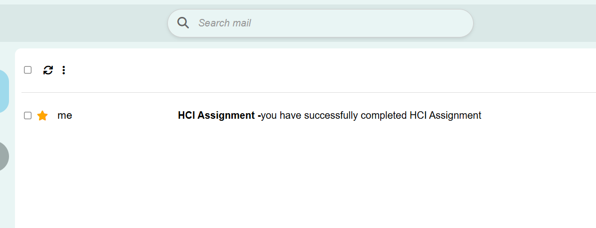
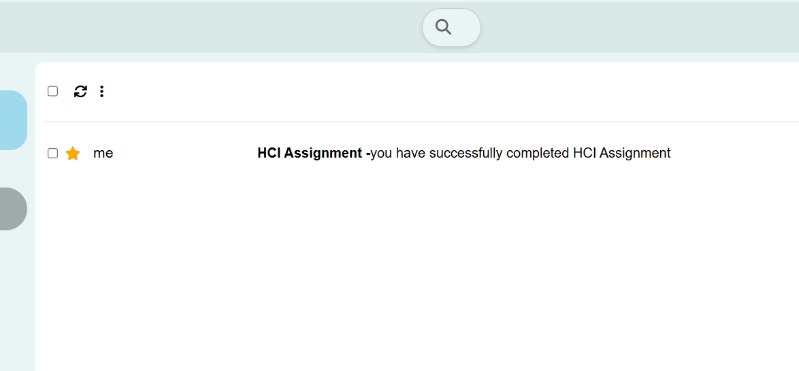
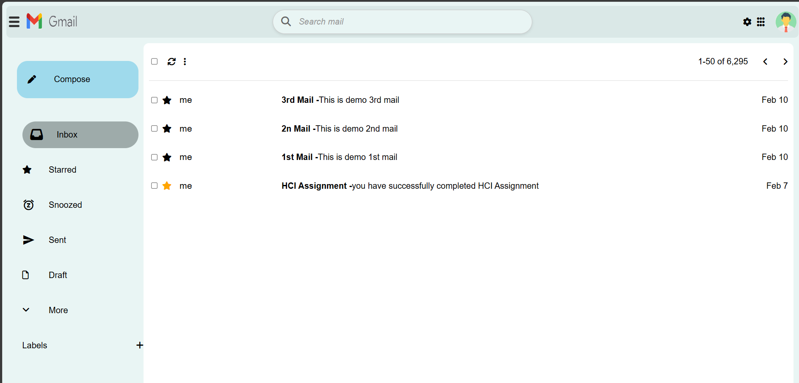
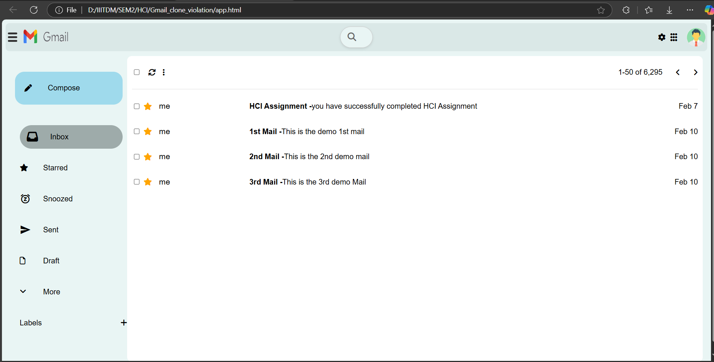
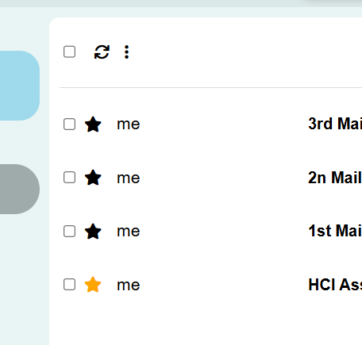
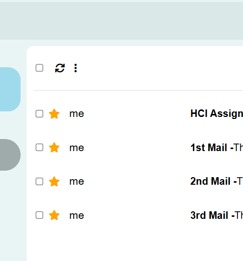
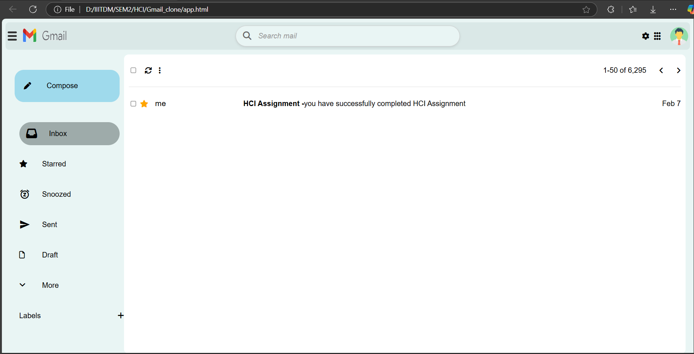
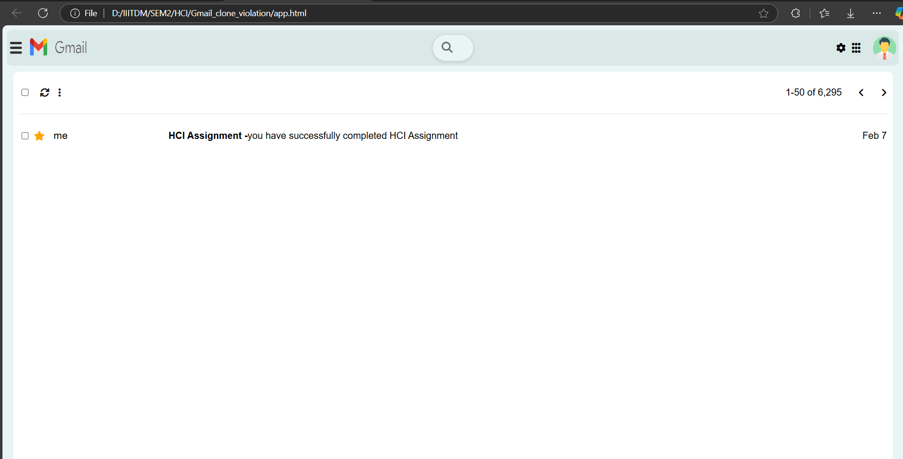

# Design Case Studies on Mental Models in Web Application Design: Gmail Case Study

## Authors
- CS24M1004 Pradhyumna
- CS24M1002 Ajay Sharon
- CS24M1010 Hari Krishnan

## Abstract
This report highlights the impact of mental model violations on web application design, using Gmail as a case study. The goal is to evaluate both a good design and a bad design based on their alignment with user expectations (mental models). The report also provides usability metrics, identifies design violations, and suggests improvements.

## Table of Contents
- [Introduction](#introduction)
- [Case Study of Gmail Design Violations](#case-study-of-gmail-design-violations)
  - [Good Design vs. Bad Design](#good-design-vs-bad-design)
  - [Violations](#violations)
- [Usability Metrics](#usability-metrics)
- [Five Mental Model Violations in Gmail Clone](#five-mental-model-violations-in-gmail-clone)
- [Conclusion](#conclusion)

## Introduction
Mental models are crucial for designing intuitive user interfaces. A mental model refers to the user's expectations about how a system should work based on prior experience, common conventions, and logic. In this report, we examine several design violations in Gmail, comparing a well-designed version of the website with a poorly designed version, and assess their impact on usability.

## Case Study of Gmail Design Violations

### Good Design vs. Bad Design
This section evaluates key features in the Gmail web application. The violations of mental models are presented along with their impact on usability.

#### Violation 1: Send Button vs. Delete Button
- **Good Design**: The send button is placed in a familiar location, aligned with user expectations.
- **Bad Design**: The send button is replaced with a delete button, violating the user's mental model.

*Good design: Send button is clearly visible.*

*Bad design: Send button replaced by the delete button.*

#### Violation 2: Search Bar Visibility
- **Good Design**: Users can see the typed characters in the search bar.
- **Bad Design**: The search bar only shows the characters once it's clicked, which violates the mental model of continuous visibility.

*Good design: Typed characters are visible in the search bar.*

*Bad design: Typed characters are only visible after clicking.*

#### Violation 3: Placement of New Messages
- **Good Design**: New messages appear at the top of the inbox, which is expected.
- **Bad Design**: New messages appear at the bottom, violating the expected mental model.

*Good design: New messages appear at the top of the inbox.*

*Bad design: New messages appear at the bottom of the inbox.*

#### Violation 4: Automatic Starred Messages
- **Good Design**: There is no automatic starring of messages.
- **Bad Design**: Every sent message is automatically starred, which might violate the user's mental model of what constitutes a starred message.

*Good design: Messages are not automatically starred.*

*Bad design: All sent messages are automatically starred.*

#### Violation 5: Visibility of Menu Bar
- **Good Design**: The menu bar containing options like *Compose*, *Inbox*, *Starred*, *Draft*, *Sent*, etc., is visible at all times.
- **Bad Design**: The menu bar is hidden and not easily accessible, violating the user's mental model of easy navigation.

*Good design: The menu bar is visible when logged in.*

*Bad design: The menu bar is hidden when logging in.*

## Usability Metrics
To evaluate the usability of the designs, we employ the following metrics based on user interactions with the Gmail clone:

### Time to Task Completion
Users were able to complete tasks more quickly in the good design compared to the bad design, which introduced confusion due to mental model violations.

### Error Rate
The number of errors made by users while completing tasks was higher in the bad design due to the violations.

### User Satisfaction
User satisfaction was measured by surveys or feedback forms. A well-designed system will have higher satisfaction scores as it aligns better with user expectations.

### Cognitive Load
Cognitive load refers to the mental effort required to perform a task. A good design minimizes cognitive load by following common conventions, while a bad design increases cognitive load due to unfamiliar elements and unexpected behaviors.

## Five Mental Model Violations in Gmail Clone
We explore five mental model violations observed in the Gmail clone and their corresponding usability metrics. About 18 people were asked about the design usability.

### Violation 1: Send Button vs. Delete Button
- **Number of Users**: 18
- **Time to Task Completion**: 15 seconds longer
- **Error Rate**: 61.11% clicked the wrong button
- **User Satisfaction**: 3.0/5
- **Cognitive Load**: High

### Violation 2: Search Bar Visibility
- **Number of Users**: 18
- **Time to Task Completion**: 8 seconds longer
- **Error Rate**: 22% had difficulty finding the search bar
- **User Satisfaction**: 2.3/5
- **Cognitive Load**: Increased

### Violation 3: Placement of New Messages
- **Number of Users**: 18
- **Time to Task Completion**: 20-30 seconds longer
- **Error Rate**: 45% missed new messages
- **User Satisfaction**: 1.5/5
- **Cognitive Load**: Moderate

### Violation 4: Automatic Starred Messages
- **Number of Users**: 18
- **Time to Task Completion**: 5 seconds longer to unstar messages
- **Error Rate**: 100% unstarred messages
- **User Satisfaction**: 1.2/5
- **Cognitive Load**: Increased

### Violation 5: Visibility of Menu Bar
- **Number of Users**: 18
- **Time to Task Completion**: 8 seconds longer
- **Error Rate**: 20% had difficulty finding features
- **User Satisfaction**: 2.8/5
- **Cognitive Load**: High

## Conclusion
This case study of Gmail design violations demonstrates the significant impact of violating user mental models on usability. The good design follows user expectations and leads to a smoother user experience, while the bad design introduces confusion, errors, and increased cognitive load. By addressing these violations, such as the confusing placement of buttons, hidden search bars, and unexpected behaviors, Gmail can significantly improve usability. The average user satisfaction scores were lower in the bad design, highlighting the need for alignment with user mental models to ensure a positive experience.